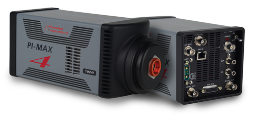

RoperScientific / Princeton
---------------




Intoduction
```````````

This plugin control a RoperScientific/Princeton camera under windows and linux, using the PVCAM (Photometrics Virtual Camera Access Method) libraries.

It is in production at Soleil under windows and it has been tested at Desy under linux .

Module configuration
````````````````````

The minimum configuration file is *config.inc* :

.. code-block:: sh

  COMPILE_CORE=1
  COMPILE_SIMULATOR=0
  COMPILE_SPS_IMAGE=1
  COMPILE_ESPIA=0
  COMPILE_FRELON=0
  COMPILE_MAXIPIX=0
  COMPILE_PILATUS=0
  COMPILE_ROPERSCIENTIFIC =1
  COMPILE_CBF_SAVING=0
  export COMPILE_CORE COMPILE_SPS_IMAGE COMPILE_SIMULATOR \
         COMPILE_ESPIA COMPILE_FRELON COMPILE_MAXIPIX COMPILE_PILATUS \
         COMPILE_ROPERSCIENTIFIC COMPILE_CBF_SAVING


Installation
````````````
TODO

Configuration
`````````````

TODO
